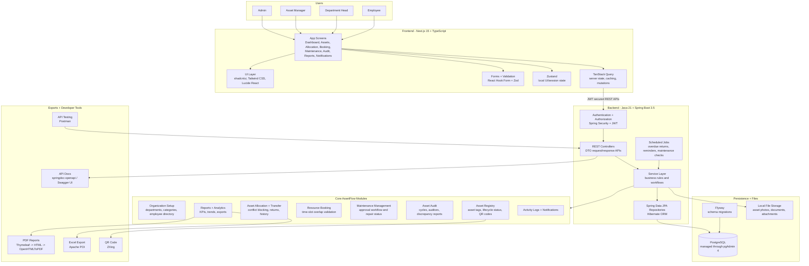

# AssetFlow Nexora

Enterprise Asset & Resource Management System for tracking assets, allocations, bookings, maintenance, audits, reports, and notifications.

## Architecture

Full architecture details: [docs/ARCHITECTURE.md](./docs/ARCHITECTURE.md)
