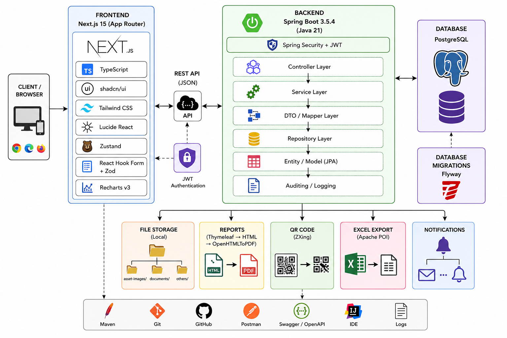

# AssetFlow Nexora

Enterprise Asset & Resource Management System for tracking assets, allocations, bookings, maintenance, audits, reports, and notifications.

## Architecture

The following diagram illustrates the end-to-end architecture of the AssetFlow Nexora platform, showing the interaction between users, the web application, backend services, and the data layer.

### System Overview

AssetFlow Nexora is designed as a modular, layered enterprise application that separates user interaction, business logic, data access, and reporting concerns. The frontend provides a responsive interface for administrators, asset managers, department heads, and employees, while the backend exposes secure APIs for managing assets, bookings, maintenance workflows, audits, and reports.

### Frontend Layer

The frontend is built using modern web technologies and offers a streamlined experience for day-to-day operations. It includes dashboards, asset management screens, booking workflows, maintenance tracking, and reporting views. The user interface is supported by state management and form handling libraries that improve usability, validation, and responsiveness.

### Application Layer

The backend layer is implemented with Java and Spring Boot and serves as the core processing engine of the system. It handles authentication and authorization, coordinates business workflows, enforces domain rules, and manages scheduled jobs for recurring tasks such as reminders, overdue returns, and maintenance checks. This layer ensures that business logic remains centralized and consistent across all modules.

### Data and Storage Layer

The application relies on a relational database for persistent storage of organizational, asset, allocation, booking, audit, and reporting data. Database migrations are managed through Flyway to maintain a reliable and version-controlled schema evolution process. File storage is also integrated to support document uploads, attachments, and related asset records.

### Reporting and Integration Capabilities

The platform includes reporting and export features to support operational oversight and decision-making. It can generate reports in PDF and Excel formats, supports QR code-based asset identification, and provides API documentation for maintainability and integration. These capabilities strengthen the platform’s usability in real-world enterprise environments.

Full architecture details: [docs/ARCHITECTURE.md](./docs/ARCHITECTURE.md)
