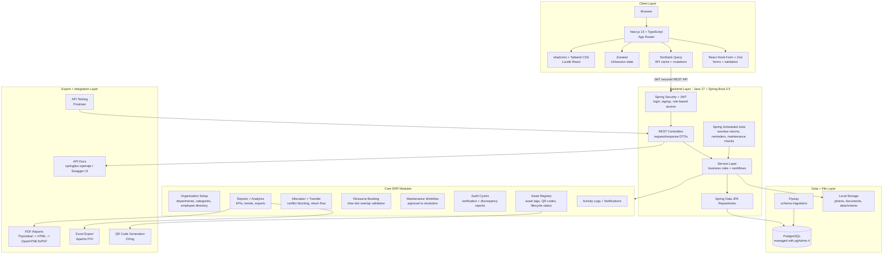

# AssetFlow Architecture

```mermaid
flowchart TB
    subgraph Client["Client Layer"]
        Browser["Browser"]
        UI["Next.js 15 + TypeScript\nApp Router"]
        Components["shadcn/ui + Tailwind CSS\nLucide React"]
        ClientState["Zustand\nUI/session state"]
        ServerState["TanStack Query\nAPI cache + mutations"]
        Forms["React Hook Form + Zod\nforms + validation"]
    end

    subgraph API["Backend Layer - Java 17 + Spring Boot 3.5"]
        Security["Spring Security + JWT\nlogin, signup, role-based access"]
        Controllers["REST Controllers\nrequest/response DTOs"]
        Services["Service Layer\nbusiness rules + workflows"]
        Repositories["Spring Data JPA Repositories"]
        Scheduler["Spring Scheduled Jobs\noverdue returns, reminders, maintenance checks"]
    end

    subgraph Modules["Core ERP Modules"]
        Org["Organization Setup\ndepartments, categories, employee directory"]
        Assets["Asset Registry\nasset tags, QR codes, lifecycle status"]
        Allocation["Allocation + Transfer\nconflict blocking, return flow"]
        Booking["Resource Booking\ntime-slot overlap validation"]
        Maintenance["Maintenance Workflow\napproval to resolution"]
        Audit["Audit Cycles\nverification + discrepancy reports"]
        Analytics["Reports + Analytics\nKPIs, trends, exports"]
        Notifications["Activity Logs + Notifications"]
    end

    subgraph Data["Data + File Layer"]
        Postgres[("PostgreSQL\nmanaged with pgAdmin 4")]
        Migrations["Flyway\nschema migrations"]
        Files["Local Storage\nphotos, documents, attachments"]
    end

    subgraph Export["Export + Integration Layer"]
        PDF["PDF Reports\nThymeleaf -> HTML -> OpenHTMLToPDF"]
        Excel["Excel Export\nApache POI"]
        QR["QR Code Generation\nZXing"]
        APIDocs["API Docs\nspringdoc-openapi / Swagger UI"]
        Postman["API Testing\nPostman"]
    end

    Browser --> UI
    UI --> Components
    UI --> ClientState
    UI --> ServerState
    UI --> Forms

    ServerState -->|"JWT secured REST API"| Security
    Security --> Controllers
    Controllers --> Services
    Services --> Modules
    Services --> Repositories
    Scheduler --> Services

    Repositories --> Postgres
    Migrations --> Postgres
    Services --> Files

    Analytics --> PDF
    Analytics --> Excel
    Assets --> QR
    Controllers --> APIDocs
    Postman --> Controllers
```

